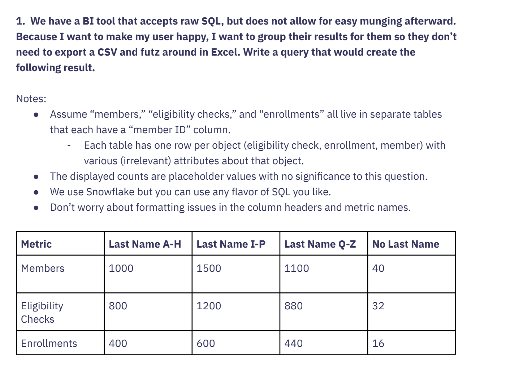
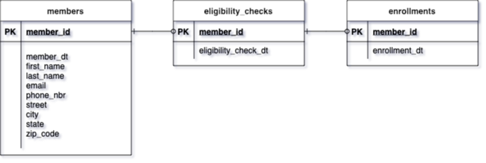

# SQL Report Generation Question

# Solution 
## TL;DR: [code/create_report.sql](code/create_report.sql) -> [output/results.csv](output/results.csv)

### Based on the description above I have taken the following approach:
* Define a data model with some simplifying assumptions
* Synthesize data according to the data model ([code/synthesize_data.py](code/synthesize_data.py))
* Develop a SQL query ([code/create_report.sql](code/create_report.sql)) using the synthetic data. I am using SQLite syntax here. 
* Test ([code/test_create_report_query.py](code/test_create_report_query.py)) that the query returns a result similar to the table above ([output/results.csv](output/results.csv))
* Provide thoughts on how to harden this solution given that the underlying report is acceptable to the customer. 

## 1. Data Model

### Data Model Assumptions:
1. There is a 1-to-1 relationship between members and eligibility checks. The members entity is mandatory, whereas eligibility_checks is optional.  Each eligibility check must have a member associated with it, but members are not required to have an eligibility check. 
2. Similarly, there is a 1-to-1 relationship between eligibility checks and enrollments. The eligibility_checks entity is mandatory, enrollments is optional.  Each enrollment must have an eligibility check associated with it, but eligibility checks are not required to have an enrollment.
3. member_id is NOT NULL and unique, but none of the other fields have NOT NULL requirements or other validation requirements.  Any data issues are treated in the query rather than at record insertion into the database.

## 2. Notes on the Query

The query ([code/create_report.sql](code/create_report.sql)) was designed to minimize data traversal, so that it can scale efficiently. 
The data is traversed twice to produce the desired table, because the three tables need to be concatenated then aggregated. 
One traversal of the data would be possible with a different data model.

Note the use of UNION ALL during concatenation.  This is necessary to avoid de-duping records when individuals have the same last name. 
If UNION was used instead, member_id would need to be brought in, which is less efficient.

The CASE clause within the ORDER BY clause allows the metric order in the example table to be maintained rather than the default 
alphabetical ordering.

## 3. Hardening the Solution
1. Deploying to production - If the user accepts this prototype, then it can be moved from dev to test and then the production environment.  
   * Address any inconsistencies between SQLite and Snowflake SQL.  Both engines use similar flavors of ANSI-SQL and should not have major differences.
   * Test query results with real data and compare to known result
   * Set up monitoring to capture usage (justify existence of report) and to log errors/failures.
2. Preferred delivery method
   * Understand users preferences to determine best report delivery option (dashboard, canned report, etc) and frequency (weekly,  on-demand?).
   * Check for downstream business processes that use this data. 
3. Enhancements - Understand how the report is being used and whether additional features such as slicers (time, region) would improve decision making. 
4. Optimization for performance, cost, and maintenance
   * Query
     * Look at reducing sub-queries. Consider whether they can be simplified or broken into separate queries, especially if the datasets are large.
     * Avoid functions in WHERE Clauses: The use of UPPER(SUBSTRING(last_name, 1, 1)) in the CASE statements might prevent the use of indexes. If possible, store and compare these values in their upper-case form to begin with, or use a computed column.
     * For readability, consider replacing implicit joins (using commas in the FROM clause) with explicit JOIN statements. 
   * Data model
     * Ensure there are indexes on member_id for all tables.  Also consider indexing on last name.
     * Consider pre-aggregation of the data if this needs to scale and the query is run often.
   * Architecture
     * Check server configuration to make sure it has adequate resources and is configured correctly for the workload.
     * Consider using a different BI tool that provides the flexibility your users need.
     * Use AWS Pricing Calculator to estimate the cost of different versions of the solution.
     

## 3. Reproducing this work
In your terminal, run the following commands:
1. `git clone https://github.com/pbolson/uno.git`
2. `cd uno`
3. `python -m venv venv`
4. `pip install -r requirements.txt`
5. `cd code`
6. `python synthesize_data.py`
7. `python test_create_report_query.py`

